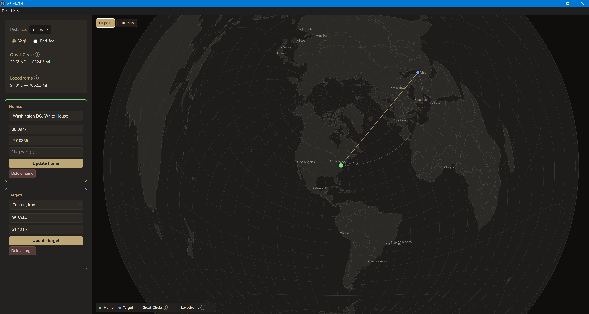

# AZIMUTH

Antenna pointing app: world map with home at center, target selection, and **short path** / **long path** bearing from North and distance. No paid map services; bundled default world map + optional user-triggered caching. Windows 11, Electron, MSIX.

**Download:** [Releases](https://github.com/oehamilton/AZIMUTH/releases) — get the Windows installer (`AZIMUTH Setup 0.1.0.exe`) or portable (`AZIMUTH 0.1.0.exe`).

## Screenshots

| Main window |
|-------------|
|  |

See **plan.md** for the full development plan and Phase 0 detailed steps.

## Quick start

```bash
pnpm install
pnpm test
pnpm start   # builds renderer and launches Electron
```

## How to run (dev + build)

- **From the IDE or terminal:** Build the renderer, then start the app:
  ```bash
  pnpm run build:renderer && pnpm start
  ```
- **One-step:** `pnpm start` runs `build:renderer` then launches Electron (see `package.json` scripts).
- **Requirements:** Node ≥20, pnpm. Windows 11 for the desktop app. No env vars required for normal run.
- **E2E:** Run `pnpm run build:renderer` once, then `pnpm e2e`. E2E launches the app via Playwright and writes results to `docs/test-results.md`.

**Test results:** Run `pnpm test:results` to run unit tests and write output to `docs/test-results.md`. Run `pnpm e2e` for the E2E run. Open `docs/test-results.md` to view.

## Installer (Windows)

- **Build installer and portable:**  
  `pnpm run build`  
  Output: `release/AZIMUTH Setup 0.1.0.exe` (NSIS installer) and `release/AZIMUTH 0.1.0.exe` (portable).
- **Unpacked app only (no installer):**  
  `pnpm run pack`
- **AppX / MSIX (e.g. for Store):**  
  `pnpm run msix`  
  Requires Windows; produces an AppX package in `release/`. Microsoft Store distribution can be added later (see plan.md).

**Icon:** Edit `build/icon.svg` and run `pnpm run build:icon` to regenerate `build/icon.png` used by the app and installer.

## Android (Capacitor)

- **Requirements:** Android Studio, JDK 17+, Node ≥20, pnpm.
- **Build and sync:**  
  `pnpm run cap:sync`  
  Builds the renderer and copies web assets into `android/`.
- **Open in Android Studio / run on device or emulator:**  
  `pnpm run android`  
  Opens the `android` project in Android Studio so you can run the app. Data is stored locally via Capacitor Filesystem (same schema as desktop).

## Stack (planned)

- **Platform:** Electron (Windows 11), Capacitor (Android). MSIX installer on Windows.
- **Maps:** Flat azimuthal projection; bundled default world map (free); optional cache from OSM
- **Data:** Single JSON file (homes, targets, preferences), local or user-chosen path (e.g. OneDrive)
